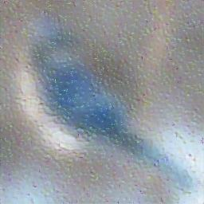
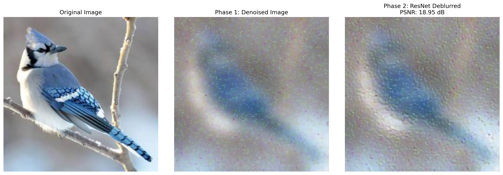
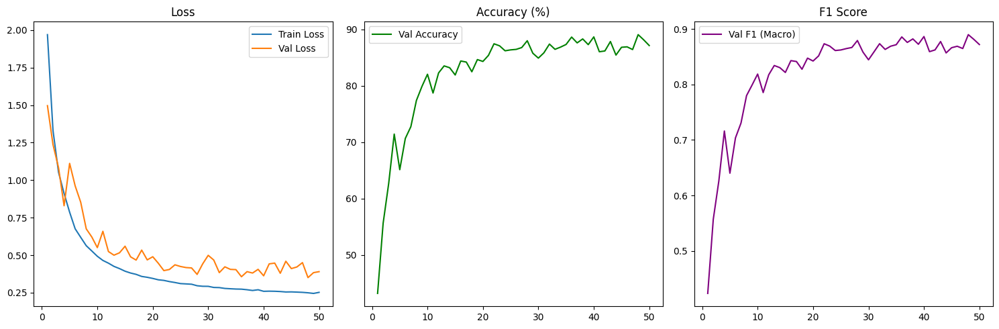
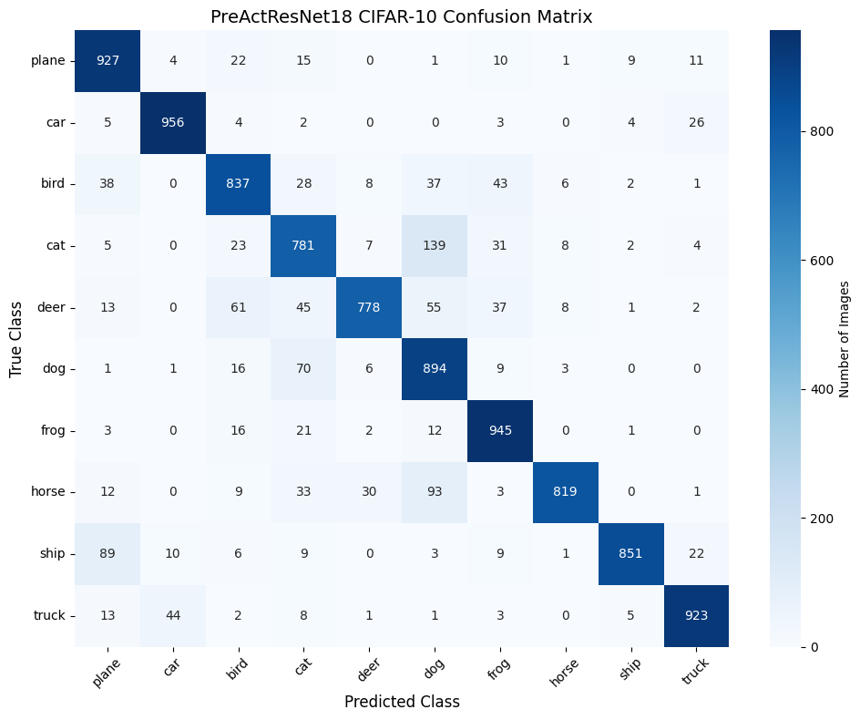

# Deep Image Restoration Pipeline
## Overview
This project implements a complete deep learning pipeline for image restoration and semantic understanding. Given a heavily corrupted image affected by salt-and-pepper noise and blur, the pipeline recovers both visual quality and semantic information using state-of-the-art deep neural networks. The restored image is then passed to a classifier to verify whether the restoration was successful enough for an AI model to understand its content.

## Project Pipeline
The complete pipeline consists of three sequential phases:

```bash
Corrupted Image 
→ Phase 1: Deep Denoising → Denoised but Blurred Image 
→ Phase 2: Deep Deblurring → Restored Image 
→ Phase 3: Image Classification → Predicted Class + Confidence
```
<p align="center">
    
    
</p>
<p align="center">
  <em>Figure 1: Blured and noisy image</em>
</p>

## Architecture
### Phase 1: Deep Denoising
For phase one I have downloaded <a href="https://www.kaggle.com/models/aastha2807/denoising?select=denoising_model.h5">denosing_model.h5</a> and used this pretrained tensorflow model.finally it asisst me to remove salt-and-pepper noise while preserving image structure.
here is my output:
<p align="center">
    
    
</p>
<p align="center">
  <em>Figure 2: denoised but still blurred image</em>
</p>


### Phase 2: Deep Deblurring
In this phase I recovered sharp edges and high-frequency information. Additonally I implemented a ResNet architecture with skip connections to preserve fine details.
<p align="center">
    
    
</p>
<p align="center">
  <em>Figure 3: deblurred image</em>
</p>

Finally I evaluated using PSNR  against ground truth
Here is the result:
``` bash
PSNR: 18.95 dB
```
<p align="center">
    
    
</p>
<p align="center">
  <em>Figure 4: Comparing images and showing results</em>
</p>


### Phase 3: Image Classification
Here I have trained a PreActResNet18 classifier on the CIFAR-10 dataset

``` bash
epoch numbers: 50
Final Val F1: 0.8719
Final Val Acc: 87.11
```
<p align="center">
    
    
</p>
<p align="center">
  <em>Figure 5: Comparing Accuracy and F1-score results
  </em>
</p>

Then I generated confusion matrix for performance analysis. as it is obvious the principal diagonal elements of this matrix are pretty high which demonstrated that my model is trained well and currently working correctly
<p align="center">
    
    
</p>
<p align="center">
  <em>Figure 6: cifar10 confusion matrix
  </em>
</p>

``` bash
Inference Results
Predicted Class : plane
Ground truth is: bird
Confidence      : 49.78%
```